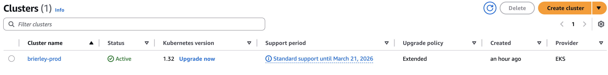
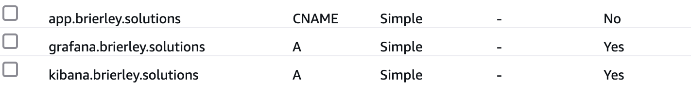
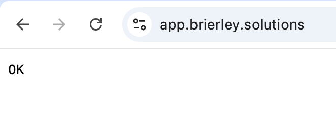
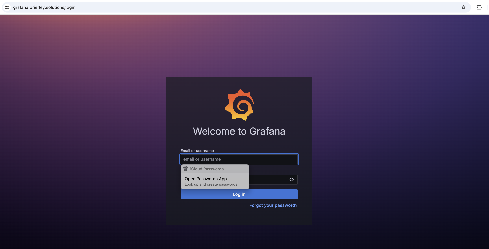
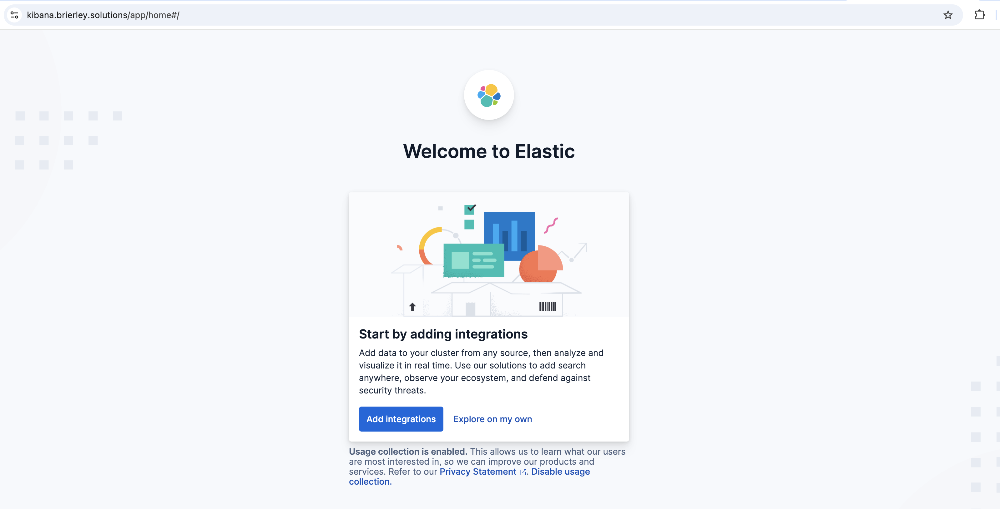

## Full-Stack Kubernetes (EKS) Setup Documentation

This guide walks through a full setup of a Kubernetes cluster using AWS EKS, including Ingress, TLS, monitoring, logging, and secrets management.

---

### ✅ 1. Prerequisites

**Install Tools:**

brew install eksctl kubectl awscli

**Access Requirements:**

* AWS IAM user with privileges
* GitHub SSH key added

**Clone Repo:**

git clone git@github.com:tombrierley01/K8s-Production.git
cd K8s-Production/infrastructure

**Configure AWS CLI:**

aws configure


### 🚀 2. Create EKS Cluster

eksctl create cluster -f eks-cluster.yaml

Wait 15–20 mins. Then check:

kubectl get nodes

---

### 📛 3. Create Required Namespaces

kubectl create namespace ingress-nginx
kubectl create namespace cert-manager
kubectl create namespace monitoring
kubectl create namespace elk
kubectl create namespace external-secrets

---

### 🌐 4. Install NGINX Ingress Controller

kubectl apply -f https://raw.githubusercontent.com/kubernetes/ingress-nginx/controller-v1.9.4/deploy/static/provider/aws/deploy.yaml

Wait until ingress controller is running:

kubectl get pods -n ingress-nginx

---

### 🔐 5. TLS Setup (Cert-Manager)

**Route 53:**

* Create a CNAME:

  * Name: `app.brierley.solutions`
  * Value: \[ELB Hostname]
  * TTL: 300

**Install Cert-Manager:**

kubectl apply -f https://github.com/cert-manager/cert-manager/releases/download/v1.14.3/cert-manager.yaml

Wait until all pods are running:

kubectl get pods -n cert-manager


**Apply Cluster Issuer:**

kubectl apply -f manifests/cert-manager/cluster-issuer.yaml

**Apply IngressClass:**

kubectl apply -f manifests/cert-manager/cert-manager-ingressclass.yaml

---

### 📊 6. Monitoring with Prometheus

helm repo update
helm repo add prometheus-community https://prometheus-community.github.io/helm-charts

helm install monitoring prometheus-community/kube-prometheus-stack \
  -n monitoring -f monitoring/values.yaml

**Create DNS Record:**

* Name: `grafana.brierley.solutions`
* Value: \[ELB Hostname]

---

### 📦 7. Logging with ELK

```bash
helm repo add bitnami https://charts.bitnami.com/bitnami
helm repo update
```

**Elasticsearch:**

```bash
helm install elasticsearch bitnami/elasticsearch \
  --namespace elk \
  --set global.storageClass=gp2 \
  --set volumePermissions.enabled=true \
  --set data.volumeClaimTemplate.storageClassName=gp2 \
  --set data.volumeClaimTemplate.resources.requests.storage=10Gi
```

**Kibana:**

helm install kibana bitnami/kibana \
  --namespace elk \
  --set "elasticsearch.hosts[0]=elasticsearch.elk.svc.cluster.local" \
  --set elasticsearch.port=9200 \
  --set persistence.enabled=true \
  --set persistence.storageClass=gp2 \
  --set persistence.size=5Gi

**Ingress for Kibana:**

kubectl apply -f manifests/ingress/kibana-ingress.yaml
```

**Create DNS Record:**

* Name: `kibana.brierley.solutions`
* Value: \[ELB Hostname]

---

### 📦 8. EBS CSI Driver Setup

**Associate OIDC provider:**

eksctl utils associate-iam-oidc-provider --region=eu-west-2 --cluster=brierley-prod-k8s --approve

**Create IAM Service Account:**

eksctl create iamserviceaccount \
  --name ebs-csi-controller-sa \
  --namespace kube-system \
  --cluster brierley-prod-k8s \
  --role-name AmazonEKS_EBS_CSI_DriverRole \
  --role-only \
  --attach-policy-arn arn:aws:iam::aws:policy/service-role/AmazonEBSCSIDriverPolicy \
  --approve

**Get Account ID and install Addon:**

ACCOUNT_ID=$(aws sts get-caller-identity --query Account --output text)

eksctl create addon \
  --name aws-ebs-csi-driver \
  --cluster brierley-prod-k8s \
  --region eu-west-2 \
  --service-account-role-arn arn:aws:iam::$ACCOUNT_ID:role/AmazonEKS_EBS_CSI_DriverRole \
  --force

---

### 🔐 9. External Secrets Setup

**Install External Secrets Operator:**

helm repo add external-secrets https://charts.external-secrets.io
helm repo update

helm install external-secrets external-secrets/external-secrets -n external-secrets

**IAM Policy for SecretsManager:**

```json
{
  "Version": "2012-10-17",
  "Statement": [
    {
      "Sid": "SecretsManagerRead",
      "Effect": "Allow",
      "Action": [
        "secretsmanager:GetSecretValue",
        "secretsmanager:DescribeSecret"
      ],
      "Resource": "*"
    }
  ]
}
```

**Create IAM Service Account:**

eksctl create iamserviceaccount \
  --name external-secrets-sa \
  --namespace external-secrets \
  --cluster brierley-prod-k8s \
  --attach-policy-arn arn:aws:iam::$ACCOUNT_ID:policy/SecretsManagerRead \
  --approve \
  --role-name external-secrets-role


**Apply Cluster Secret Store:**

kubectl apply -f manifests/external-secrets/cluster-secret-store.yaml

---

### 🩵 10. Log Collection with Fluent Bit

helm repo add fluent https://fluent.github.io/helm-charts
helm install fluent-bit fluent/fluent-bit --namespace elk \
  --set backend.type=es \
  --set backend.es.host=elasticsearch.elk.svc.cluster.local \
  --set backend.es.port=9200

---

### 🚀 11. Deploy Application & Ingress

**Apply Ingress Resource:**

kubectl apply -f manifests/ingress/


**Get ELB Hostname:**

kubectl get svc -n ingress-nginx


**Deploy Application:**

kubectl apply -f manifests/app/

**Confirm Certificate:**

kubectl describe certificate nodejs-app-tls

## 📸 Screenshots

Here are some screenshots of the Kubernetes production setup in action:

### 🔧 EKS Cluster


### 🌐 Route53 Configuration


### 📦 App Running


### 📊 Monitoring with Grafana


### 🔍 ELK Stack for Logging

